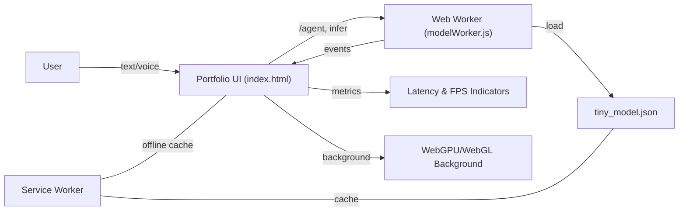

## Quantum‑Pixel Web Architect – 2025 Edition

Building a lightning‑fast, visually spellbinding portfolio that scales to planetary traffic. Every frame and millisecond is engineered for delight and resilience.

### 🔗 Live Site
- https://vikas9793.github.io/

---

### ✨ Highlights
- **Instant feel**: Critical hints, deferred heavy work, and a lean service worker deliver snappy loads.
- **Alive visuals**: GPU‑friendly motion, parallax nebula, magnetic buttons, and tasteful micro‑interactions.
- **Robust UX**: Accessible, keyboard‑friendly, and resilient on low‑power devices.
- **Comprehensive Portfolio**: Showcases 8 featured AI/ML projects and PM case studies
- **Professional Credentials**: IBM & Google certified AI Product Manager with extensive certifications

---

### 🎯 Portfolio Content

**Featured Projects (8 total):**
1. **Netflix India PM Case Study** - Educational framework demonstrating PM research methodology
2. **MoatMetrics** - Enterprise analytics platform for MSPs ($12B market opportunity)
3. **CharacterCraft Pro** - AI platform for character consistency in generated images (94% accuracy)
4. **EduVault** - Offline-first educational platform for rural India with accessibility compliance
5. **AI Interview Simulation System** - Privacy-first conversational agent with enterprise pilot
6. **KrishiSahayak+Gemma** - Offline AI advisory system for rural agriculture
7. **Docu-Agent** - Local-first AI documentation system for enterprise knowledge management
8. **Portfolio Management** - AI-driven analytics at Aditya Birla Capital (₹100Cr AUM)

**Professional Sections:**
- Industry simulation experience (EA, JPMorgan, AWS)
- 11+ professional certifications (IBM, Google, PMI, DeepLearning.AI, etc.)
- Contact information and social links

---

### 🧱 Tech Stack Overview

- **Core**
  - HTML5 semantic structure (`index.html`)
  - CSS3 with modern custom properties and fluid type scales
  - Vanilla JavaScript (no heavy frameworks)

- **Typography & Icons**
  - Google Fonts: `Space Grotesk` (primary) & `JetBrains Mono` (code/monospace)
  - Font Awesome 6 via CDN

- **Performance Engineering**
  - Preconnect/DNS‑prefetch for CDNs and fonts
  - Lazy initialization via `requestIdleCallback`/timeouts
  - Content‑visibility and contain‑intrinsic‑size on sections
  - IntersectionObserver for reveal/lazy effects
  - Service Worker (`sw.js`): network‑first for HTML, cache‑first for assets
  - Reduced‑motion fallbacks respected via `prefers-reduced-motion`

- **Graphics & Motion**
  - WebGL background shader (lightweight, single full‑screen quad)
  - CSS gradients, blend modes, and keyframe animations
  - Parallax using pointer tracking + `requestAnimationFrame`
  - Magnetic buttons + tilt cards (pointer‑based micro‑interactions)

- **AI/UX Layer**
  - In‑page “AI Assistant” widget with simulated analysis pipeline
  - Typing effect with variable pacing and idle/burst timing

- **Accessibility & UX**
  - High‑contrast palette on dark surface
  - Keyboard shortcuts (focus search, toggle chat, ESC to close)
  - ARIA attributes for interactive widgets

---

### 📁 Project Structure

```
.
├─ index.html          # Main app (UI, graphics init, chat, RUM, commands)
├─ sw.js               # Service Worker (offline cache: HTML, worker, tiny model)
├─ modelWorker.js      # Web Worker: tiny intent model, inference, agent demo
├─ tiny_model.json     # Offline tiny intent model (keyword-weight scoring)
└─ README.md           # Documentation
```

---

### 🗺️ System Flow (Mermaid)



---

### 🚀 Running Locally

Service workers require `https` or `localhost`.

- Quick serve (Python):
  - Python 3: `python -m http.server 8080`
  - Open: `http://localhost:8080/`

Or use any static server (VS Code Live Server, http-server, serve, etc.).

---

### 📈 Performance Tactics Used

- Resource **hints**: `dns-prefetch` + `preconnect` for `cdnjs`, `fonts.googleapis.com`, `fonts.gstatic.com`
- **Defer heavies**: WebGL/init work deferred with `requestIdleCallback`/timeouts
- **Lazy effects**: IntersectionObserver for reveal and card observation
- **Cache strategy**: Network‑first HTML for freshness; cache‑first for static assets
- **Motion budget**: GPU‑friendly transforms; respects reduced‑motion

---

### 🧠 On‑Device ML & Performance (2025)

- **Tiny intent model (offline)**: `tiny_model.json` bundled, keyword‑weight scoring
- **ML Web Worker**: `modelWorker.js` runs inference off main thread
  - Progressive load: tiny model immediately, full model hook reserved for idle
  - Throttled inference (≈2 Hz) to avoid jank
- **RUM metrics**: chat input→response latency and model inference ms
- **Adaptive frame guard**: dampens parallax on frame spikes to protect 120 fps
- **Offline ready**: Service Worker caches `index.html`, `modelWorker.js`, `tiny_model.json`

How it works
- UI posts chat text to the worker; worker returns `{intent, latency, model}`
- Indicators in chat show current model and last inference time
- Full model upgrade path kept for future (idle hot‑swap)

---

### 🤖 Agentic Demo (Local, Offline)

- **/agent command**: Type `/agent <goal>` in chat to start a demo agent
- **Planner/Executor**: Runs inside `modelWorker.js` (off main thread)
  - Emits `agent-status`, `agent-plan`, and `agent-result` events
  - Prints planned steps and completion summary in chat
- **Privacy & Safety**: No external calls; runs fully in a worker sandbox

---

### 🖥️ Graphics & Motion (WebGPU/WebGL)

- **WebGPU background** with automatic WebGL fallback via `initGraphics()`
- **Adaptive intensity**: visual effects scale using `--intensity` to protect 120fps
- **Reduced motion**: respects `prefers-reduced-motion` and tab visibility changes

---

### 🔐 Security & Headers

- **CSP**: Locks down sources to self + fonts/CDN; workers restricted to self
- **No external AI APIs** by design; inference and agent logic run locally

---

### 🔧 Customization

- Swap the Google Font in the `@import` and `preconnect` lines
- Tune hero typography via the `.hero-title` `clamp()` values
- Adjust shader intensity/opacity inside `initWebGL()`
- Expand the service worker `STATIC_ASSETS` list if you add new static files

---

### ✅ Compatibility Targets

- Modern evergreen browsers (Chromium, Firefox, Safari)
- Graceful degradation when WebGL or View Transitions are unavailable

---

### 🧪 Suggested Checks (Optional)

- Lighthouse (Performance, Accessibility, Best Practices, SEO)
- WebPageTest for first‑byte and render path
- Throttle CPU/Network in DevTools to validate motion smoothness

---

### 📜 License

Personal/portfolio usage. Adapt freely for your own site.


