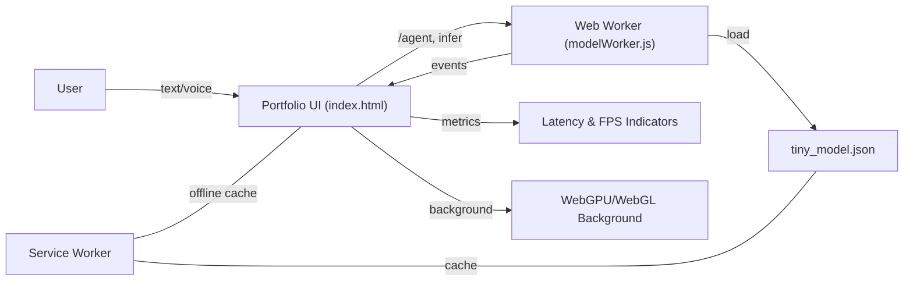

## Welcome to My Portfolio! 👋

**Hello there!** Welcome to my digital space where technology meets innovation. I'm **Vikas Sahani**, a Certified AI Product Manager with a passion for building impactful solutions that bridge the gap between complex AI/ML technologies and real-world business value.

### 🚀 My Mission
To transform complex AI/ML technologies into user-friendly, scalable products that deliver measurable business impact. I specialize in translating technical concepts into clear business value while managing the entire product lifecycle from conception to market success.

### 💼 Let's Connect!
- **📧 Email**: vikassahani17@gmail.com
- **📱 Phone**: +91 7715072817
- **💼 LinkedIn**: [linkedin.com/in/vikas-sahani-727420358](https://www.linkedin.com/in/vikas-sahani-727420358)
- **🐙 GitHub**: [github.com/VIKAS9793](https://github.com/VIKAS9793)

*Open to opportunities in AI Product Management, strategic consulting, and innovative tech collaborations.*

---

## 🔗 Live Portfolio
**https://vikas9793.github.io/**

*Explore my featured projects, professional credentials, and industry experience directly on the portfolio.*

---

## 🧱 Technical Architecture

- **Core**
  - HTML5 semantic structure (`index.html`)
  - CSS3 with modern custom properties and fluid type scales
  - Vanilla JavaScript (no heavy frameworks)

- **Typography & Icons**
  - Google Fonts: `Space Grotesk` (primary) & `JetBrains Mono` (code/monospace)
  - Font Awesome 6 via CDN

- **Performance Engineering**
  - Preconnect/DNS‑prefetch for CDNs and fonts
  - Lazy initialization via `requestIdleCallback`/timeouts
  - Content‑visibility and contain‑intrinsic‑size on sections
  - IntersectionObserver for reveal/lazy effects
  - Service Worker (`sw.js`): network‑first for HTML, cache‑first for assets
  - Reduced‑motion fallbacks respected via `prefers-reduced-motion`

- **Graphics & Motion**
  - WebGL background with Three.js (particle effects)
  - CSS gradients, blend modes, and optimized animations
  - Floating Action Buttons (FAB) - Modern mobile-inspired UI
  - Smooth hover effects with tooltips and playful rotations
  - Project cards with 3D tilt effects on hover

- **Accessibility & UX**
  - WCAG AA compliant color contrast
  - Full keyboard navigation and ARIA attributes
  - Skip links for screen readers
  - Reduced motion preferences respected
  - Mobile-first responsive design
  - Touch-friendly floating action buttons

---

### 📁 Project Structure

```
.
├─ index.html          # Main portfolio (113KB optimized)
├─ sw.js               # Service Worker (offline cache, image optimization)
├─ modelWorker.js      # Web Worker: ML inference, agent demo
├─ tiny_model.json     # Offline intent model (keyword-weight scoring)
├─ images/             # Project screenshots and banner
├─ AUDIT_REPORT.md     # Comprehensive codebase audit (A- grade)
└─ README.md           # Documentation
```

---

### 🗺️ System Flow (Mermaid)



---

### 🚀 Running Locally

Service workers require `https` or `localhost`.

- Quick serve (Python):
  - Python 3: `python -m http.server 8080`
  - Open: `http://localhost:8080/`

Or use any static server (VS Code Live Server, http-server, serve, etc.).

---

### 📈 Performance Optimizations

- **Resource hints**: `dns-prefetch` + `preconnect` for CDNs and fonts
- **Lazy loading**: IntersectionObserver for animations and content
- **Image optimization**: Retry logic, preloading, caching strategy
- **Service Worker**: Aggressive caching for images and assets
- **Content Security Policy**: Enabled with proper directives
- **Code optimization**: Removed 160+ lines of redundant CSS/JS
- **Zero console logs**: Clean production build
- **Motion budget**: GPU‑friendly transforms, reduced‑motion support
- **Bundle size**: 113KB (down from 117KB)

---

### 🧠 Key Features

- **Modern UI/UX**: Floating Action Buttons (FAB) sidebar design
- **Full-width Banner**: Edge-to-edge hero section with preserved content
- **On-device ML**: Tiny intent model with Web Worker inference
- **Service Worker**: Offline functionality and aggressive caching
- **WebGL Graphics**: Interactive 3D background with Three.js particles
- **Privacy-first**: All processing happens locally, no external APIs
- **Mobile-optimized**: Touch-friendly, responsive on all devices
- **SEO Optimized**: Structured data, Open Graph, Twitter Cards

### 🎨 Design Highlights

- **Hero Banner**: Google-inspired colorful design with smiley face
- **FAB Buttons**: Circular floating buttons with hover tooltips
  - Green rocket button → Projects section
  - Blue chat button → Connect section
- **Smooth Animations**: Fade-in effects, playful button rotations
- **Dark Theme**: Modern black background with neon accents
- **Typography**: Space Grotesk + JetBrains Mono fonts

---

### 📊 Quality Metrics

- **Overall Grade**: A- (90/100)
- **Performance**: 90/100
- **SEO**: 95/100
- **Accessibility**: 88/100
- **Security**: 90/100 (CSP enabled)
- **Code Quality**: 85/100

See `AUDIT_REPORT.md` for detailed analysis.

---

### 🎯 Recent Updates (2025-01-10)

- ✅ Redesigned with floating action buttons (FAB)
- ✅ Full-width banner with edge-to-edge coverage
- ✅ Removed 160+ lines of redundant code
- ✅ Eliminated all console.log statements
- ✅ Re-enabled Content Security Policy
- ✅ Cleaned unused CSS animations and styles
- ✅ Optimized for performance and accessibility

---

### 📜 License

Personal/portfolio usage. Adapt freely for your own site.


