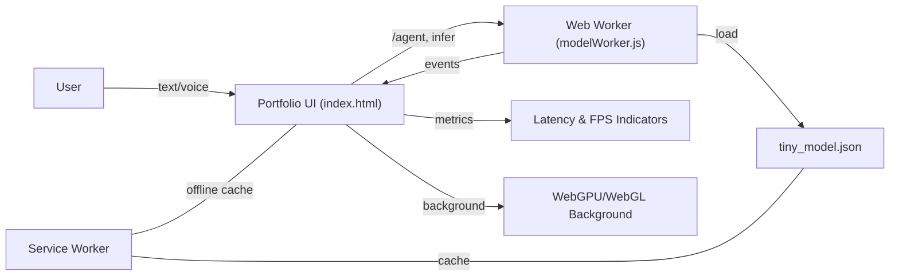

## Welcome to My Portfolio! 👋

**Hello there!** Welcome to my digital space where technology meets innovation. I'm **Vikas Sahani**, a Certified AI Product Manager with a passion for building impactful solutions that bridge the gap between complex AI/ML technologies and real-world business value.

### 🚀 My Mission
To transform complex AI/ML technologies into user-friendly, scalable products that deliver measurable business impact. I specialize in translating technical concepts into clear business value while managing the entire product lifecycle from conception to market success.

### 💼 Let's Connect!
- **📧 Email**: vikassahani17@gmail.com
- **📱 Phone**: +91 7715072817
- **💼 LinkedIn**: [linkedin.com/in/vikas-sahani-727420358](https://www.linkedin.com/in/vikas-sahani-727420358)
- **🐙 GitHub**: [github.com/VIKAS9793](https://github.com/VIKAS9793)

*Open to opportunities in AI Product Management, strategic consulting, and innovative tech collaborations.*

---

## 🔗 Live Portfolio
**https://vikas9793.github.io/**

*Explore my featured projects, professional credentials, and industry experience directly on the portfolio.*

---

## 🧱 Technical Architecture

- **Core**
  - HTML5 semantic structure (`index.html`)
  - CSS3 with modern custom properties and fluid type scales
  - Vanilla JavaScript (no heavy frameworks)

- **Typography & Icons**
  - Google Fonts: `Space Grotesk` (primary) & `JetBrains Mono` (code/monospace)
  - Font Awesome 6 via CDN

- **Performance Engineering**
  - Preconnect/DNS‑prefetch for CDNs and fonts
  - Lazy initialization via `requestIdleCallback`/timeouts
  - Content‑visibility and contain‑intrinsic‑size on sections
  - IntersectionObserver for reveal/lazy effects
  - Service Worker (`sw.js`): network‑first for HTML, cache‑first for assets
  - Reduced‑motion fallbacks respected via `prefers-reduced-motion`

- **Graphics & Motion**
  - WebGL background shader (lightweight, single full‑screen quad)
  - CSS gradients, blend modes, and keyframe animations
  - Parallax using pointer tracking + `requestAnimationFrame`
  - Magnetic buttons + tilt cards (pointer‑based micro‑interactions)

- **Accessibility & UX**
  - High‑contrast palette on dark surface
  - Keyboard navigation and ARIA attributes
  - Reduced motion preferences respected

---

### 📁 Project Structure

```
.
├─ index.html          # Main app (UI, graphics init, chat, RUM, commands)
├─ sw.js               # Service Worker (offline cache: HTML, worker, tiny model)
├─ modelWorker.js      # Web Worker: tiny intent model, inference, agent demo
├─ tiny_model.json     # Offline tiny intent model (keyword-weight scoring)
└─ README.md           # Documentation
```

---

### 🗺️ System Flow (Mermaid)



---

### 🚀 Running Locally

Service workers require `https` or `localhost`.

- Quick serve (Python):
  - Python 3: `python -m http.server 8080`
  - Open: `http://localhost:8080/`

Or use any static server (VS Code Live Server, http-server, serve, etc.).

---

### 📈 Performance Tactics Used

- Resource **hints**: `dns-prefetch` + `preconnect` for `cdnjs`, `fonts.googleapis.com`, `fonts.gstatic.com`
- **Defer heavies**: WebGL/init work deferred with `requestIdleCallback`/timeouts
- **Lazy effects**: IntersectionObserver for reveal and card observation
- **Cache strategy**: Network‑first HTML for freshness; cache‑first for static assets
- **Motion budget**: GPU‑friendly transforms; respects reduced‑motion

---

### 🧠 Advanced Features

- **On-device ML**: Tiny intent model with Web Worker inference
- **Service Worker**: Offline functionality and performance optimization
- **WebGL Graphics**: Interactive 3D background with Three.js
- **Privacy-first**: All processing happens locally, no external APIs

---

### 📜 License

Personal/portfolio usage. Adapt freely for your own site.


